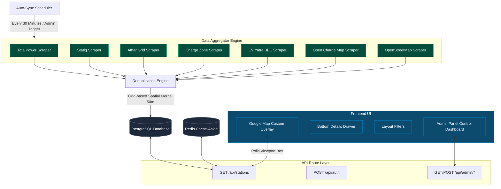

# Full Charge: India's Unified EV Discovery Platform

Welcome to **Full Charge**, a comprehensive Next.js-based web application that aggregates real-time electric vehicle (EV) charging station data from multiple Indian Charge Point Operators (CPOs) and open geospatial repositories. It deduplicates these locations, manages credentialed API integrations, and serves them via an interactive, high-performance map.

This document serves as a complete technical guide to the codebase, explaining how components fit together, what data pipelines are in place, and how the core systems function.

---

## 🏗️ Architectural Overview

The application is structured as a modern full-stack TypeScript project utilizing Next.js (App Router), Tailwind CSS v4, Postgres, Prisma, Redis, and Google Maps.



---

## 🗃️ Database Schema

The database models are configured in [schema.prisma](file:///c:/Users/athar/Downloads/iit/sourbh%20project/prisma/schema.prisma) using PostgreSQL.

1. **`Station`**: Represents a physical EV charging location.
   - Stores metadata: `source`, `name`, `operator`, `address`, `city`, `state`, `pincode`, and location coordinates (`latitude`, `longitude`).
   - Contains status indicators (`AVAILABLE`, `OCCUPIED`, `OFFLINE`, `UNKNOWN`).
   - Uses a unique constraint on `[source, externalId]` to prevent collisions.
2. **`Connector`**: Represents a charging plug attached to a specific station.
   - Stores type (e.g., `CCS2`, `TYPE2`, `GB_T`, `WALL_SOCKET`), power output in kilowatts (`powerKw`), current flow (`AC` / `DC`), plug status, and unit pricing.
3. **`CpoCredential` & `CrawlerLog`**: Allows the admin panel to securely configure, store, and refresh session-related information (e.g., Bearer tokens, spoofed headers, cookies) for proprietary CPO APIs. Error logs monitor crawling health.
4. **`User`, `Account`, `Session`**: Auth schemas supporting Next-Auth. Includes a user `Role` (`USER` / `ADMIN`) to restrict admin endpoints.
5. **`Favorite` & `Review`**: Stores user favorites and rating/comments (1 to 5 stars) for stations.

---

## ⚙️ Data Aggregator Engine

Located in [src/services/aggregator/](file:///c:/Users/athar/Downloads/iit/sourbh%20project/src/services/aggregator), this system fetches charging station details from 7 separate endpoints.

### 1. External APIs & Crawlers
- **Open Charge Map (OCM)** ([ocm.ts](file:///c:/Users/athar/Downloads/iit/sourbh%20project/src/services/aggregator/ocm.ts)): Connects to the public OCM registry using standard parameters.
- **OpenStreetMap (OSM)** ([osm.ts](file:///c:/Users/athar/Downloads/iit/sourbh%20project/src/services/aggregator/osm.ts)): Sends spatial requests to OSM's Overpass API, querying coordinates within India with tags containing `amenity=charging_station`.
- **EV Yatra BEE** ([evyatra.ts](file:///c:/Users/athar/Downloads/iit/sourbh%20project/src/services/aggregator/evyatra.ts)): Queries the official Bureau of Energy Efficiency (BEE) endpoint. If the government server is down, it falls back to a curated regional dataset of high-density charging hubs.
- **Direct CPO Integrations**:
  - **Tata Power** ([tataPower.ts](file:///c:/Users/athar/Downloads/iit/sourbh%20project/src/services/aggregator/cpos/tataPower.ts)): Reads the active database credentials (tokens, user agents) to perform a direct query. If no active credential exists, it triggers a fallback Guest Scraper. It batches detail requests with concurrency safety to bypass rate-limiting.
  - **Statiq** ([statiq.ts](file:///c:/Users/athar/Downloads/iit/sourbh%20project/src/services/aggregator/cpos/statiq.ts)): Fetches all active markers inside a geographic bounding box covering India, then queries detailed specifications in parallel batches.
  - **Ather Grid** ([atherGrid.ts](file:///c:/Users/athar/Downloads/iit/sourbh%20project/src/services/aggregator/cpos/atherGrid.ts)) & **Charge Zone** ([chargeZone.ts](file:///c:/Users/athar/Downloads/iit/sourbh%20project/src/services/aggregator/cpos/chargeZone.ts)): Custom scrapers fetching station attributes and mapping connector standards.

### 2. Deduplication Engine
Because multiple datasets (such as OCM, OSM, and Tata Power) can index the same physical station, the **`DeduplicationEngine`** ([dedupe.ts](file:///c:/Users/athar/Downloads/iit/sourbh%20project/src/services/aggregator/dedupe.ts)) resolves duplicates:
- **Grid-Based Clustering**: Grouping stations inside grid blocks of $0.005$ degrees (~500m) to optimize search performance from $O(N^2)$ to $O(N)$.
- **Merging Threshold**: Computes exact geodesic distance using `geolib`. Any two stations within **50 meters** of each other are identified as a single station.
- **Priority Hierarchy**:
  $$\text{Tata Power} \succ \text{Ather Grid} \succ \text{Charge Zone} \succ \text{Statiq} \succ \text{Open Charge Map} \succ \text{EV Yatra} \succ \text{OpenStreetMap}$$
  The engine merges attributes into the station from the highest-priority source. Connectors from official CPOs are strictly retained.
- **Atomic Operations**: Deletes old connectors and upserts stations dynamically within database transactions.

### 3. Synchronization Driver
[autoSync.ts](file:///c:/Users/athar/Downloads/iit/sourbh%20project/src/services/aggregator/autoSync.ts) contains the schedule driver:
- Exports `initAutoSync()` which executes an initial crawl 5 seconds after startup and schedules a recurring job every **30 minutes**.
- Runs each crawler sequentially, reports counts and execution times, deduplicates findings, and records outcomes in-memory for the Admin panel.

---

## ⚡ Spatial Setup and Caching

### 1. Database PostGIS Integration
The script [db-init.ts](file:///c:/Users/athar/Downloads/iit/sourbh%20project/scripts/db-init.ts) establishes native spatial options in Postgres:
1. Attempts to load the `postgis` extension.
2. Adds a geography Point column `location` (SRID 4326) to the `Station` table.
3. Sets up a Postgres trigger `trigger_update_station_location` to auto-calculate the geographic `location` using `ST_SetSRID(ST_MakePoint(longitude, latitude), 4326)::geography` on any insertion or update.
4. Generates a GiST index `station_location_gist_idx` for fast spatial search.
5. If PostGIS is unavailable, the script gracefully outputs a warning and skips trigger setups, allowing standard floating-point boundary filtering to run as a failover.

### 2. Bounding Box Cache-Aside Layer
The main endpoint [GET /api/stations](file:///c:/Users/athar/Downloads/iit/sourbh%20project/src/app/api/stations/route.ts) reads viewport parameters (`north`, `south`, `east`, `west`) to fetch stations:
- **Coordinate Rounding**: Bounding coordinates are rounded to **2 decimal places** (e.g. `19.076` -> `19.08`). This groups nearby panning adjustments, creating high cache hit rates.
- **Cache-Aside Pattern**: Creates a cache key representing the rounded box and user filters. Reads from Upstash Redis or a Local Redis container first. On a cache miss, queries PostgreSQL and caches the results back to Redis with a short time-to-live (**TTL = 15 seconds**).

---

## 🔐 Auth & Admin Framework

### 1. Simplified Credentials Login
To ease local development, [auth.ts](file:///c:/Users/athar/Downloads/iit/sourbh%20project/src/lib/auth.ts) configures a Credentials provider named **"Email Login"**:
- When logging in, typing any email address and selecting a role (e.g., `ADMIN` or `USER`) will automatically create or update the user record with that role in the database.
- Eliminates the need to configure Google API OAuth keys or SMTP settings locally.

### 2. Admin Sessions Panel
The page [/admin/sessions](file:///c:/Users/athar/Downloads/iit/sourbh%20project/src/app/admin/sessions/page.tsx) acts as a centralized command center:
- **Database Statistics**: Summarizes total stations, connectors, reviews, and a breakdown of CPO networks, connector types, and charger statuses.
- **Crawler Status Log**: Shows last-sync summary records (run duration, number of stations scraped per provider) and displays recent HTTP/Auth crawler logs.
- **Token Manager**: Contains form fields where admins can insert updated bearer tokens, cookie headers, and expiration dates forTata Power or Statiq APIs.
- **Sync Trigger**: Includes a manual "Trigger Full Sync" action that overrides the scheduler to run the pipeline instantly.

---

## 🎨 Interactive User Interface

1. **Interactive Google Map** ([Map.tsx](file:///c:/Users/athar/Downloads/iit/sourbh%20project/src/components/map/Map.tsx)):
   - Configures a premium dark-styled maps canvas.
   - Listens to bounds adjustments and retrieves stations dynamically from the endpoint.
   - Renders custom HTML overlays using [CustomHTMLOverlay.ts](file:///c:/Users/athar/Downloads/iit/sourbh%20project/src/components/map/CustomHTMLOverlay.ts) containing status indicators:
     - **Pulsing green ring** $\rightarrow$ Available
     - **Amber ring** $\rightarrow$ Occupied
     - **Rose ring** $\rightarrow$ Offline
     - **Slate ring** $\rightarrow$ Unknown
   - Displays operator labels (e.g., "Tata", "Ather") and the maximum connector capacity (e.g., "60kW").
2. **Filters Bar** ([Filters.tsx](file:///c:/Users/athar/Downloads/iit/sourbh%20project/src/components/layout/Filters.tsx)):
   - Allows users to toggle specific networks (Tata, Statiq, Ather), connector formats (CCS2, Type 2), speeds (AC, DC), and status.
3. **Bottom Sheet Drawer** ([BottomDrawer.tsx](file:///c:/Users/athar/Downloads/iit/sourbh%20project/src/components/layout/BottomDrawer.tsx)):
   - Displays specific station details, real-time availability of individual connectors, and amenities.
   - Allows users to add reviews, submit ratings, and add the station to their favorites.
4. **Zustand App Store** ([useStore.ts](file:///c:/Users/athar/Downloads/iit/sourbh%20project/src/store/useStore.ts)):
   - Stores maps center, user coordinates, select items, bounds, and active filters.

---

## 🚀 How It Works: Step-by-Step Flow

### Data Sync Pipeline
```
[30-Min Cron / Manual Click] 
     │
     ▼
[autoSync.ts] triggers all scrapers in parallel/sequence
     │
     ├── tataPower.ts   --> Reads CpoCredential token or uses Guest auth
     ├── statiq.ts      --> Bounding box markers -> detail batches
     ├── evyatra.ts     --> BEE portal api (fallback to regional array)
     └── ocm.ts/osm.ts  --> Open-source maps queries
     │
     ▼
[DeduplicationEngine] clusters lat/lng inside 50m grids
     │
     ▼
Merges duplicate records, selecting details by CPO priority order
     │
     ▼
Saves deduplicated stations and replaces connector tables in DB
```

### Live Map Interaction Flow
```
User opens site -> Geolocates center -> Sets Map viewport
     │
     ▼
Google Maps triggers "idle" -> Computes box coordinates
     │
     ▼
React Query fetches `/api/stations?north=...&south=...`
     │
     ▼
API rounds coordinates to 2 decimal places -> Computes cache key
     │
     ├── [Redis Hit]  --> Instantly returns viewport stations JSON
     └── [Redis Miss] --> Queries Postgres -> Caches in Redis (15s TTL) -> Returns JSON
     │
     ▼
Map.tsx renders custom HTML overlays with statuses, power ratings, and CPO labels
     │
     ▼
User clicks station -> Zustand updates `selectedStationId`
     │
     ▼
BottomDrawer opens -> Polls detailed station data, reviews, and amenities
```

---

## 🛠️ Essential Files Reference

For development and inspection, these are the main entry points:
- **Database Rules**: [schema.prisma](file:///c:/Users/athar/Downloads/iit/sourbh%20project/prisma/schema.prisma)
- **Data Scraper Drivers**: [autoSync.ts](file:///c:/Users/athar/Downloads/iit/sourbh%20project/src/services/aggregator/autoSync.ts) and [dedupe.ts](file:///c:/Users/athar/Downloads/iit/sourbh%20project/src/services/aggregator/dedupe.ts)
- **Spatial Configurer**: [db-init.ts](file:///c:/Users/athar/Downloads/iit/sourbh%20project/scripts/db-init.ts)
- **Station Search/Map API**: [route.ts (stations)](file:///c:/Users/athar/Downloads/iit/sourbh%20project/src/app/api/stations/route.ts)
- **Google Maps Layer**: [Map.tsx](file:///c:/Users/athar/Downloads/iit/sourbh%20project/src/components/map/Map.tsx)
- **Admin Session Control**: [page.tsx (admin)](file:///c:/Users/athar/Downloads/iit/sourbh%20project/src/app/admin/sessions/page.tsx)
