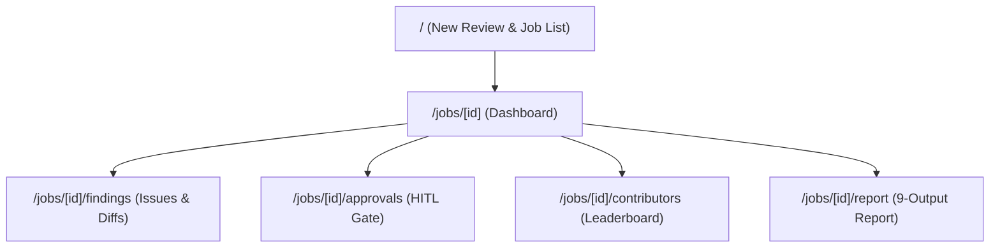

# CodeGuard UI Page & Component Catalog

This document details the Next.js 14 frontend architecture for **CodeGuard** (`ui/` folder). It maps out all routing directories, layout structures, active page modules, reusable UI kit elements, and provides structured design recommendations for your upcoming UI redesign.

---

## 🏛️ Routing & Page Modules (`ui/app/`)

The application uses the Next.js **App Router**. The views are divided into two main categories:
1. **Control / Setup Dashboard**: The root route where users launch reviews and browse historical jobs.
2. **Job Review Workspace**: Under `/jobs/[id]`, which hosts a shared sidebar/topbar layout and multi-view workspaces for live tracking, vulnerability browsing, human-in-the-loop approvals, and reporting.

---

### 1. Root / Setup Page
* **Route**: `/`
* **File Location**: [ui/app/page.tsx](file:///c:/Users/athar/OneDrive/Documents/Github%20vigriousone/test/ui/app/page.tsx)
* **Functionality**: Serves as the landing view where users configure and spin up new autonomous code reviews, and monitor existing jobs.
* **Component Breakdown**:
  * **Brand Header**: Small brand bar showing the CodeGuard logo and name.
  * **Source Tab Switcher**: Toggles between **ZIP Upload** and **GitHub Source** modes.
  * **ZIP Dropzone Label**: A drag-and-drop target backing files up to 200MB. Shows a file card with size representation and clear/remove button when a file is selected.
  * **GitHub Clone Form**: Input elements for Repository URL, branch/tag (optional), and GitHub access tokens (password input, used once, never stored).
  * **Review Options Grid**: Displays the `OptionToggle` switches configured for:
    * Sandbox execution (`sandbox_run`)
    * Traceback-driven self-healing (`self_heal`)
    * Test generation and validity checking (`test_synthesis`)
    * Low-risk auto-apply fixes (`auto_apply_low_risk`)
    * High-risk HITL gating (`require_approval_high_risk`)
  * **Start Button**: Triggers the file upload / clone request and navigates to the workspace.
  * **Feature Highlights Strip**: High-level card indicators outlining sandbox execution, self-healing, and human governance capabilities.
  * **Jobs List (`JobsList` sub-component)**: Queries the backend list of reviews every 5 seconds to show:
    * Repository name, job UUID, findings count, and creation date.
    * Status badges (DONE, ERROR, AWAITING_APPROVAL, RUNNING).
    * Deletion interface (opens confirmation modal to drop DB entries and erase storage files).

---

### 2. Job Workspace Layout
* **Route Prefix**: `/jobs/[id]/*`
* **File Location**: [ui/app/jobs/[id]/layout.tsx](file:///c:/Users/athar/OneDrive/Documents/Github%20vigriousone/test/ui/app/jobs/[id]/layout.tsx)
* **Functionality**: Wraps all workspace panels with a responsive split navigation dashboard.
* **Component Breakdown**:
  * **Top Loader Indicator (`TopLoader`)**: Appears at the very top of the window as an animated loading line while a job is running.
  * **Sidebar Layout (`SidebarContent`)**: Contains brand logo, workspace tabs, repository name, job UUID, status indicator, and a shortcut to initiate a new review.
  * **Topbar Dashboard Navigation Header (`TopBar`)**: Includes breadcrumbs displaying the repository name and current tab, a live status pill, and an actions dropdown (export JSON report, export HTML report, and copy job UUID).
  * **Mobile Navigation Drawer (`Sheet`)**: Opens a sliding sidebar drawer for screens narrower than `lg` break point.

---

### 3. Job Dashboard Page
* **Route**: `/jobs/[id]`
* **File Location**: [ui/app/jobs/[id]/page.tsx](file:///c:/Users/athar/OneDrive/Documents/Github%20vigriousone/test/ui/app/jobs/[id]/page.tsx)
* **Functionality**: Serves as the central console for real-time monitoring of active agents and summarized stats.
* **Component Breakdown**:
  * **Approval Interrupt Bar**: A persistent notice bar linking to `/jobs/[id]/approvals` that lights up when the orchestrator is paused waiting for user feedback.
  * **KPI Summary Grid (`KpiCard` elements)**: 
    * *Findings*: Shows the total count broken down by severity.
    * *Critical + High*: Highlights severe findings requiring attention.
    * *Self-heals*: Tracks sandbox patches applied and promoted.
    * *Stage*: Represents current pipeline status.
  * **Overview Visualizations**:
    * *Pipeline progress* (`ProgressRing`): Displays percentage completion of the 10 stages.
    * *Severity breakdown* (`SeverityDonut`): A donut chart mapping critical, high, medium, and low vulnerabilities.
    * *Throughput tracker* (`Sparkline`): Tracks agent events per interval.
  * **Pipeline stages list (`PipelineTimeline`)**: A step-by-step indicator showing the active step, complete steps, and detail lines (e.g. self-healing unit name).
  * **Live Agent Feed (`AgentFeed`)**: Scrollable area displaying the continuous StreamEvent payloads coming from the backend Server-Sent Events (SSE).

---

### 4. Code Review Findings Page
* **Route**: `/jobs/[id]/findings`
* **File Location**: [ui/app/jobs/[id]/findings/page.tsx](file:///c:/Users/athar/OneDrive/Documents/Github%20vigriousone/test/ui/app/jobs/[id]/findings/page.tsx)
* **Functionality**: Explorer to browse static and dynamic issues found by agents.
* **Component Breakdown**:
  * **Header Controls**: Title, count labels, text search box, and filtering tabs (All, Vulns, Bugs, Critical).
  * **Findings List Table (`Table`)**: Lists findings with columns for severity, issue type, location (file + line), short message summary, and agent confidence. Support column sorting for Severity and Confidence.
  * **Vulnerability & Code Details Panel**: Displays when a row in the table is clicked:
    * *Vulnerability metadata*: Severe badges, CWE classes, file locations.
    * *Code snippet preview* (`CodePanel`): Shows the exact block of code where the issue was caught.
    * *Suggested patch* (`DiffView`): Interactive diff showing lines to delete (-) and lines to insert (+).
    * *Grounding sources*: RAG citation nodes retrieved from the security knowledge base.
    * *Calibrated confidence* (`ConfidenceBar`): The final confidence level determined by the Verifier Agent.

---

### 5. Approvals (Human-in-the-Loop) Page
* **Route**: `/jobs/[id]/approvals`
* **File Location**: [ui/app/jobs/[id]/approvals/page.tsx](file:///c:/Users/athar/OneDrive/Documents/Github%20vigriousone/test/ui/app/jobs/[id]/approvals/page.tsx)
* **Functionality**: Interactive queue where developers sign off on high-risk (A3) code fixes.
* **Component Breakdown**:
  * **Header Overview**: Introduction to high-risk classification criteria.
  * **Approvals Cards List**: Loops through pending fixes. Each card displays:
    * Risk details: Autonomy index (A3) and risk level.
    * Verification indicator: Shows if the sandbox successfully compiled/verified the patch.
    * Path to file and code diff visualization (`DiffView`).
    * Agent rationale callout (`NoteCallout`) explaining why the patch was designed this way and what root cause it fixes.
    * Decision buttons (Approve & apply vs Reject).
  * **Audit Log & Autonomy Reference Accordion**: Details how low-risk (A1/A2) changes are handled automatically, preserving review transparency.

---

### 6. Contributor Leaderboard Page
* **Route**: `/jobs/[id]/contributors`
* **File Location**: [ui/app/jobs/[id]/contributors/page.tsx](file:///c:/Users/athar/OneDrive/Documents/Github%20vigriousone/test/ui/app/jobs/[id]/contributors/page.tsx)
* **Functionality**: Attribute issues to authors using git blame details (only visible for repositories cloned from GitHub).
* **Component Breakdown**:
  * **KPI Summary Tiles**:
    * Total contributors.
    * Cleanest author (fewest findings/line).
    * Needs attention (highest finding density).
  * **Leaderboard Ranking Table**: Columns include:
    * Rank index and Avatar fallback (computed initials).
    * Contributor name and email.
    * Code quality score gauge (`ConfidenceBar` style).
    * Overall Grade badge (A, B, C, D, F).
    * Total lines owned.
    * Breakdown of findings attributed to them (represented by severity-colored blocks).
    * Issue density (severity-weighted findings per 100 lines).

---

### 7. Full Review Report Page
* **Route**: `/jobs/[id]/report`
* **File Location**: [ui/app/jobs/[id]/report/page.tsx](file:///c:/Users/athar/OneDrive/Documents/Github%20vigriousone/test/ui/app/jobs/[id]/report/page.tsx)
* **Functionality**: The unified report displaying all nine outputs generated by the agent mesh.
* **Component Breakdown**:
  * **Headline Metrics Row**:
    * *Security Score*: Radial gauge (0-100) detailing vulnerability penalties.
    * *Quality Score*: Radial gauge (0-100) representing maintainability and reliability.
    * *Fixes Applied Card*: Count of proposed, applied, and quarantined patches.
  * **Navigation Sidebar (Table of Contents)**: Sticky navigation links jumping to individual report sections.
  * **Nine Report Sections**:
    1. **Code Review Report**: Broad description of the repository health.
    2. **Bug Detection Summary**: List of bugs found, file positions, and severities.
    3. **Security Vulnerability Report**: Grouped breakdown of vulnerabilities categorized by CWE classes.
    4. **Detailed Quality Metric Gauges**: Horizontal bar breakdowns for Maintainability, Reliability, and Security.
    5. **Suggested Code Fixes**: Logs of all agent-generated fixes with their autonomy indices and application status.
    6. **SOP Runbooks**: Interactive checklist guides for developers on preventing these security bugs.
    7. **Explainability Report**: Rationale behind critical agent classifications.
    8. **Confidence Score Tiles**: Mean confidence, ratio of verified fixes, and hallucination metrics.
    9. **Human Approval Log**: List of user-approved or rejected actions, documenting a complete compliance trail.
    10. **Synthesized Test Suites**: Renders test results generated in the sandbox (includes targets, test outcomes, run durations, failure rationales, and collapsible code views).

---

## 🎨 Custom UI Kit Components (`ui/components/ui-kit/`)

Rather than relying on basic styling blocks, CodeGuard isolates custom layout and chart components under `ui-kit/`:

| Component File | Exports | Purpose / Details |
|---|---|---|
| [charts.tsx](file:///c:/Users/athar/OneDrive/Documents/Github%20vigriousone/test/ui/components/ui-kit/charts.tsx) | `SeverityDonut` `Sparkline` `MiniBar` `ScoreGauge` `ProgressRing` | Renders Recharts widgets for scores, severity breakdowns, and progress rings. |
| [command-menu.tsx](file:///c:/Users/athar/OneDrive/Documents/Github%20vigriousone/test/ui/components/ui-kit/command-menu.tsx) | `CommandMenu` `TopLoader` | Implements the global `⌘K` command dialog for fast routing navigation. |
| [controls.tsx](file:///c:/Users/athar/OneDrive/Documents/Github%20vigriousone/test/ui/components/ui-kit/controls.tsx) | `OptionToggle` `ScoreCard` `CardsSkeleton` | Standardizes switches, headline cards, and skeleton layouts. |
| [kpi-card.tsx](file:///c:/Users/athar/OneDrive/Documents/Github%20vigriousone/test/ui/components/ui-kit/kpi-card.tsx) | `KpiCard` | Displays stylized dashboard stats with fade animations and icons. |
| [pipeline-feed.tsx](file:///c:/Users/athar/OneDrive/Documents/Github%20vigriousone/test/ui/components/ui-kit/pipeline-feed.tsx) | `PipelineTimeline` `AgentFeed` | Vertical step progress rail and real-time SSE stream log. |
| [primitives.tsx](file:///c:/Users/athar/OneDrive/Documents/Github%20vigriousone/test/ui/components/ui-kit/primitives.tsx) | `SectionTitle` `SevBadge` `StatusPill` `NoteCallout` `CodePanel` `DiffView` `ConfidenceBar` `EmptyState` | Global elements like code displays, diff highlighting, callouts, and empty states. |
| [sidebar.tsx](file:///c:/Users/athar/OneDrive/Documents/Github%20vigriousone/test/ui/components/ui-kit/sidebar.tsx) | `SidebarContent` | Custom left-hand workspace sidebar with animated active links. |
| [topbar.tsx](file:///c:/Users/athar/OneDrive/Documents/Github%20vigriousone/test/ui/components/ui-kit/topbar.tsx) | `TopBar` | Breadcrumbs, live execution status, and download export dropdown. |

---

## 🎨 Redesign Recommendations & Strategy

To elevate the UI to a premium level, focus on these visual and layout improvements:

### 1. Visual Polish & Aesthetic Themes
* **Glassmorphism Sidebar & Workspace**: Replace the solid slate left-hand sidebar with a dark semi-transparent sidebar using `backdrop-blur-md` and thin border outlines (`border-white/10`).
* **Rich Color Accent Gradients**: Replace basic background colors with deep space palettes (e.g., `#090e1a` base for dark mode, using neon accents like Teal/Cyan for success, Magenta/Crimson for vulnerabilities, and Warm Amber for warnings).
* **Enhanced Code Diffs**: Use a split-pane comparison view (Original vs. Patched) rather than a single unified diff block, rendering line numbers on both sides with subtle fading highlight animations on hover.

### 2. Live Agent Tracing (ReAct Panel)
* **Interactive Node Graphs**: Use a lightweight diagram library (like React Flow or SVG overlays) to animate the active agent nodes during pipeline execution, highlighting communication lines between agents (e.g. self-healing triggering Critic validation).
* **Verbose Thought Panels**: Allow users to click on any active step in the pipeline rail to read the specific "Thought/Action/Observation" logs generated by the agent mesh.

### 3. Report Section Organization
* **Grid Dashboard Layout**: Instead of a very long scrolling report page, use a tabbed grid layout separating sections into:
  1. *Executive Summary & Scores* (Section 1, 4, 8)
  2. *Security Vulnerability Details* (Section 3, 5, 6, 9)
  3. *Bug & Test Engineering Reports* (Section 2, 10)
  4. *Explainability & Audit Logs* (Section 7)
